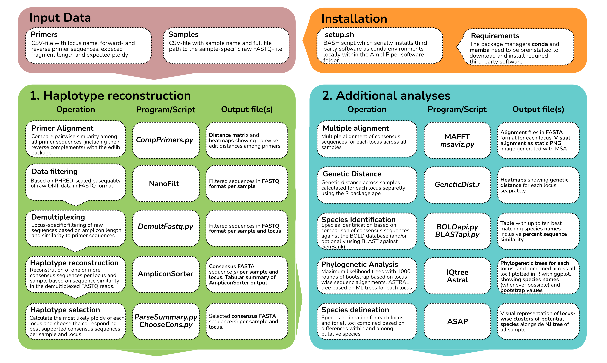

<div align="center">
   
   
   
   
   
   <!-- <div>
        <a href="https://astrabert.github.io/AmpliPiper-docs/"></a>
   </div> -->
</div>


---

This README provides a quickstart to the pipeline: if you want to dive deeper, check out the [complete_documentation](https://astrabert.github.io/AmpliPiper-docs/).

### Workflow

<div align="center">
   
</div>

### Overview

AmpliPiper is a comprehensive workflow based on *BASH scripting*, *Python* and *R* for analyzing high-throughput amplicon sequencing data for multiple samples and loci. The pipeline performs various tasks, including raw read demultiplexing, filtering, consensus sequence reconstruction, species identification and phylogenetic analysis. 

### Third party programs used in the pipeline

* [`NanoFilt`](https://github.com/wdecoster/nanofilt) for read filtering
* [`amplicon_sorter.py`](https://github.com/avierstr/amplicon_sorter) for consensus sequence reconstruction
* [`bold_api.py`](https://v3.boldsystems.org/index.php/api_home) for species identification using the BOLD API
* [`BLASTapi.py`](https://biopython.org/docs/dev/Tutorial/chapter_blast.html) BLAST with Bio.Python for species identification
* [`iqtree`](http://www.iqtree.org/) for maximum likelihood tree reconstruction
* [`astral`](https://github.com/smirarab/ASTRAL) for concatenated tree reconstruction
* [`asap`](https://bio.tools/asap-assemble) for species delineation
* [`MAFFT`](https://mafft.cbrc.jp/alignment/software/) for multi-sequence alignment
* [`pigz`](https://zlib.net/pigz/) for multithreaded (de-)compression
* [`GNU parallel`](https://www.gnu.org/software/parallel/) for parallelisation
* [`R`](https://www.r-project.org/) for plotting and statistical analyses

All installation commands and additional *Python* and *R* package that are required are listed in `setup.sh` which can be found in the `shell` folder. 

### Installation 

The installation of dependencies requires [mamba](https://mamba.readthedocs.io/en/latest/installation/mamba-installation.html) and [conda](https://docs.conda.io/projects/conda/en/latest/user-guide/install/index.html) to be already installed on your system.

To install the pipeline program:

1. Clone this repository:
   ```bash
   git clone https://github.com/nhmvienna/AmpliPiper.git
   ```
2. Go to the cloned directory:
   ```bash
   cd AmpliPiper
   ```
3. Run the setup script:
   ```bash
   bash shell/setup.sh
   ```
At the end of the installation, you will find all the needed dependencies in a folder called `envs`. Alternatively, the dependencies will be automatically installed the first time you run AmpliPiper.

This process may take a while and there might be problems when installing: please check [TROUBLESHOOTING - Installation](https://astrabert.github.io/AmpliPiper-docs/docs/search/#installation) in the [complete_documentation](https://astrabert.github.io/AmpliPiper-docs/).

AmpliPiper runs on UNIX platforms. The installation and execution of AmpliPiper has been successfully tested on different Linux systems (Ubuntu/CentOS). However, due to a [dependency issue in amplicon_sorter](https://github.com/avierstr/amplicon_sorter/issues/14) it is not yet possible to run AmpliPiper on Apple computers with macos.

After that you should be ready to execute the shell script `AmpliPiper.sh` in the `shell/` folder to carry out all steps in the analysis pipeline.

### Usage

#### Input files

You need to prepare two input files to run the pipeline:

1- `samples.csv`: this file contains all sample names and the full paths to the FASTQ input files you are using for your analysis. It should look like this:
     
```
ON_A29_2,/media/user/projects/reads/ON_A29_2.fq.gz
ON_A30_28,/media/user/projects/reads/ON_A30_28.fq.gz
ON_A4_2h,/media/user/projects/reads/ON_A4_2h.fq.gz
ON_A5_29,/media/user/projects/reads/ON_A5_29.fq.gz
ON_A5_3,/media/user/projects/reads/ON_A5_3.fq.gz
```   
2- `primers.csv`: a file containing forward and reverse primer sequences, along with length information about the loci to analyze. It should look like this:
    
```
ID,FWD,REV,SIZE
COX1,CAAGCCCTCCTAGTGCTCAA,ATGATTTTCACAAGCATACCTCAA,780
ITS,CAAGCCCTCCTAGTGCTCAA,AAGATTTCCACGAGCATACCTC,780
MATK_RBCL,GGATGATGTCTCAAGCCCTTC,TTTTCACGAGCATACCTCAATG,780
CTYB,GATGCCTCAAGCCCTCCTA,AAGATTTCCACGAGCATACCTC,780
``` 
> :warning: The Species identificion with BOLD only works for amplicons of (1) Cytochrome c oxidase subunit I (**COX1**), (2) Internal transcribed spacer (**ITS**) or (3) maturase K and/or ribulose 1,5-biphosphate carboxylase (**MATK_RBCL**). Make sure that the locus IDs in the primer files match exactly the locus names **COX1**, **ITS** or **MATK_RBCL** for the corresponding locus in your dataset. :warning:


### Run the pipeline

#### Required Arguments

* `-s` or `--samples`: Provide the path to a CSV file containing the names and paths to the raw FASTQ files for each sample.
* `-p` or `--primers`: Provide the path to a CSV file containing the IDs, forward and reverse sequences, and ploidy (1 for haploid, 2 for diploid) of each primer.
* `-o` or `--output`: Specify the path to the output folder.

**Optional Arguments**

* `-b` or `--blast`: Enable BLAST search for species identification. When setting this parameter, you need to provide an email address (e.g., `--blast your@email.com`) for using NCBI entrez to retrieve taxonomic information for the BLAST hits (default: disabled).
* `-e` or `--exclude`: Provide a text file with samples and loci to exclude from the analysis. Each row should contain the ID of a sample to be excluded. Names need to be identical to the IDs in `samples.csv`
* `-f` or `--force`: Force overwrite the output folder if it already exists (default: cowardly refusing to overwrite).
* `-i` or `--partition`: Use partition model for iqtree with combined dataset. :warning: may take very long :warning: (default: disabled)
* `-k` or `--kthreshold`: Define the threshold *k* for the maximum allowed proportion of mismatches for primer alignment during demultiplexing (default: 0.05).
* `-m` or `--minreads`: Set the minimum number of reads required for consensus sequence reconstruction (default: 100).
* `-n` or `--nreads`: Provide the absolute number or percentage of top-quality reads to consider for consensus sequence generation and variant calling (default: 500).
* `-q` or `--quality`: Specify the minimum PHRED quality score for read filtering (default: 10).
* `-r` or `--sizerange`: Define the allowed size buffer in basepairs around the expected locus length (default: 100).
* `-t` or `--threads`: Specify the number of threads to be used for parallel processing (default: 10).
* `-w` or `--nowatermark`: Remove the watermark from the tree figures
* `-y` or `--freqthreshold`: The minimum frequency of reads supporting a given consensus sequence retained for further analyses(default: 0.1).


#### Example command

:warning: In the following command, make sure to **replace `<path_to>` with the actual path to your files** :warning:

```bash
bash <path_to>/shell/AmpliPiper.sh \
    --samples <path_to>/testdata/data/samples.csv \
    --primers <path_to/testdata/data/primers.csv \
    --output <path_to>/testdata/results/demo \
    --quality 10 \
    --nreads 1000 \
    --blast your@email.com \
    --similar_consensus 97 \
    --threads 200 \
    --kthreshold 0.05 \
    --minreads 50 \
    --sizerange 100 \
    --outgroup He_mor_41 \
    --force

```

This will execute the pipeline and save the output in the `demo` folder. 

If you want to test the pipeline on a test dataset, please check out the `testdata/` folder within this repository and execute the commands in the `testdata/main.sh` shell script.


#### Analysis steps

> :warning: _From the 7th of November, since BOLD upgraded from v4 to v5, the API service is migrating and thus unavailable. We advise that you use, for now, BLAST and, if you do not wish to perform species identification, we suggest to change the name of the loci (for example, from `COX1` to `COI`)._

1. **Demultiplexing**: The pipeline uses `demultiplex_fastq.py` to demultiplex the raw fastq files based (1) on correct alignment of the primer sequences at the terminal ends of a raw FASTQ file and (2) on the expected length of the amplicon .
2. **Filtering**: The pipeline uses `NanoFilt` to remove low-quality reads based on a PHRED-scaled quality threshold.
3. **Consensus Sequence Reconstruction**: The pipeline uses `amplicon_sorter.py` to reconstruct consensus sequences for each locus and sample.
4. **Choice of Haplotypes**: The pipeline uses `ChooseConsensus.py` to estimate the expected ploidy and chooses consensus haplotypes reconstructed with amplicon_sorter that match in frequency with the expected ploidy based on maximum likelihood tests.
5. **Species Identification**: The pipeline uses, as a default, `bold_api.py` to identify species based on the BOLD API using the consensus sequences either of **COX1**, **ITS** or **MATK_RBCL** amplicons. There is also the possibility to use BLAST API for the same loci, by setting the `--blast` flag: the two species identification services are mutually exclusive. 
6. **Phylogenetic Analysis**: The pipeline uses `iqtree` to reconstruct maximum likelihood (ML) trees for each locus separately and for all loci combined. In addition, `astral` is used to reconstruct a concatenated tree across all loci based on the locus-specific ML-trees.
7. **Genetic Distance Calculation**: The pipeline uses `treedistance.py` to calculate Robinson-Foulds distances between trees.
8. **Species Delineation**: The pipeline uses `asap` to perform species delineation for each locus and the concatenated dataset (obtained with `MergeAln.py`).
9. **HTML Summary**: The pipeline uses `displayoutput.py` to generate an HTML summary of the results.

**Output structure**
----------------
Output directory will be structured like this:

```bash
demo
├── data
│   ├── demultiplexed
│   ├── filtered
│   └── raw
├── log
│   ├── ampliconsorter
│   ├── demulti
│   ├── html
│   ├── SpecDelim
│   ├── SpecID
│   ├── summary
│   └── variantcalling
├── results
│   ├── astraltree
│   ├── consensus_seqs
│   ├── haplotypes
│   ├── html
│   ├── SpeciesDelim
│   ├── SpeciesID
│   ├── summary
|   └── tree
├── Output
│   ├── SpeciesDelim
│   ├── SpeciesID
│   ├── astraltree
│   ├── consensus_seqs
│   ├── haplotypes
│   ├── summary
│   ├── tree
|   └── results.html
└── shell
    ├── demult1
    └── demult2
```

You will see a summary of the results by displaying `results.html` in your browser, for example:

```bash
firefox testresults/Output/results.html
```
See the [RESULTS explanation page](https://astrabert.github.io/AmpliPiper-docs/docs/navigation-structure/) in the [complete_documentation](https://astrabert.github.io/AmpliPiper-docs/) to get a thorough breakdown of the results.


**License**
-------

AMPLIPIPER is an [open source project](./LICENSE) licenced under [GPL3](./LICENSE).

**Acknowledgments**
---------------

We wish to thank all the amazing people that supported the project and shared advice or opinions about it, as well as all the teams and people behind the software employed in our pipeline.

This project has been funded and is being developed as part of [TETTRIs - Task 6.2, WP6](https://tettris.eu).

 
